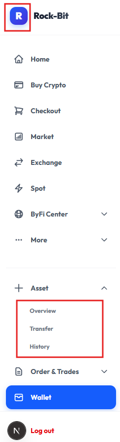

<div align="center">

# ⚡ Rock-Bit Crypto Exchange

### Next-Generation Cryptocurrency Portfolio Tracking, Spot Trading & Admin Control Platform

*Bridging real-time market data, interactive candlestick terminals, and stateful user administration into a unified Web3 ecosystem.*

[](https://rock-bit-five.vercel.app/)
&nbsp;
[](https://nextjs.org/)
&nbsp;
[](https://vercel.com/)
&nbsp;
[](https://tailwindcss.com/)

<br/>



</div>

---

## 📖 Table of Contents

- [✨ Overview](#-overview)
- [🌐 Live Platform](#-live-platform)
- [❌ The Problem & ✅ The Solution](#-the-problem---the-solution)
- [🚀 Key Features](#-key-features)
  - [👤 Customer Trading & Asset Ecosystem](#-customer-trading--asset-ecosystem)
  - [🛡️ Admin Dashboard & Control Center](#-admin-dashboard--control-center)
- [📦 Tech Stack & Architecture](#-tech-stack--architecture)
- [🛠️ Installation & Setup](#-installation--setup)
- [🚢 Production Deployment](#-production-deployment)
- [🤝 Contributing & License](#-contributing--license)

---

## ✨ Overview

**Rock-Bit** is an enterprise-grade cryptocurrency exchange, spot trading terminal, and user management platform built with **Next.js 16 (App Router)**, **React 19**, and **Tailwind CSS v4**. 

Designed with modern glassmorphism aesthetics, live Binance market data integration, and stateful administration workflows, Rock-Bit provides a seamless Web3 experience for both crypto traders and platform administrators.

---

## 🌐 Live Platform

* **Live Web Application:** [https://rock-bit-five.vercel.app](https://rock-bit-five.vercel.app/)
* **GitHub Repository:** [https://github.com/CoderGUY47/Rock-Bit](https://github.com/CoderGUY47/Rock-Bit)

---

## ❌ The Problem & ✅ The Solution

> **Crypto platforms require high performance, robust security, and distinct user vs admin workflows.**

| ❌ Traditional Bottlenecks | ✅ Rock-Bit's Solution |
| :--- | :--- |
| **Merged Admin/User Routes** creating security risks | Strict route isolation with `/admin-*` paths served via dedicated `DashboardShell` |
| **Static or Delayed Market Data** | Live price tickers, orderbooks, and interactive SVG candlestick charts |
| **Complex Asset Management** | Integrated Asset Hub with **Overview**, **Instant Internal Transfers**, and **Audit Logs** |
| **Basic User Management** | Stateful Admin User CRUD with SVG avatar pickers, status toggles, and user timelines |
| **Slow Mobile Response** | Mobile-first responsive grids, dark/light theme toggle, and standard `rounded-md` UI |

---

## 🚀 Key Features

### 👤 Customer Trading & Asset Ecosystem

- **📊 Live Spot & Exchange Terminals (`/spot`, `/exchange`)**: Interactive SVG candlestick charts, real-time order books, recent trades, and instant order placement (Limit, Market, Stop-Limit).
- **💼 Asset Center (`/assets/overview`, `/assets/transfer`, `/assets/history`)**:
  - **Overview**: Estimated total portfolio balance, asset allocation bars, and wallet distribution.
  - **Transfer**: Zero-fee instant transfers between Spot, Margin, Funding, and Futures wallets.
  - **History**: Searchable audit logs of deposits, withdrawals, transfers, and staking rewards.
- **👛 Multi-Wallet Hub (`/wallet`)**: PnL tracking, coin distribution charts, deposit & withdrawal actions.
- **🤖 Interactive 3D AI Assistant**: Floating 3D chatbot powered by Three.js and Gemini AI for market recommendations.
- **⚙️ Profile Security (`/profile`)**: 2FA verification, API Key creation with secret key masking, login history logs, and referral tracking.

---

### 🛡️ Admin Dashboard & Control Center

- **📈 Executive Analytics (`/admin-home`)**: Interactive Recharts graphs displaying **User Growth**, **Trade Volume by Coin**, **Order Ratios**, and **Revenue Statistics**.
- **👥 User Management & CRUD (`/admin-profile`)**:
  - Stateful user administration (Add, Edit, Delete, Suspend/Activate, KYC verification toggle).
  - 15 selectable custom SVG avatars.
  - User activity timelines and interactive 3-dots action menus.
- **📊 Admin Markets Terminal (`/admin-markets`)**: Real-time candlestick charts and spot market pairs switcher.
- **🛒 Checkout & Order Auditing (`/admin-checkout`, `/admin-orders`)**: Complete transaction history table with fee tracking and search filters.
- **💳 Wallet Analytics (`/admin-wallet`)**: Deposit vs withdrawal cash flow graphs and per-user wallet breakdowns.

---

## 📦 Tech Stack & Architecture

- **Frontend Framework:** Next.js 16 (App Router) & React 19
- **Styling:** Tailwind CSS v4 & Lucide/React Icons
- **Data Visualization:** Recharts & Interactive Custom SVG Trading Charts
- **3D Graphics:** Three.js & React Three Fiber (`@react-three/fiber`, `@react-three/drei`)
- **Authentication & Database:** Better Auth & Supabase PostgreSQL
- **Deployment:** Vercel Cloud Platform

---

## 🛠️ Installation & Setup

### Prerequisites

- **Node.js**: v18.0.0 or higher
- **npm** or **yarn**

### 1. Clone the Repository

```bash
git clone https://github.com/CoderGUY47/Rock-Bit.git
cd Rock-Bit
```

### 2. Install Dependencies

```bash
npm install
```

### 3. Environment Setup

Create a `.env.local` file in the root directory:

```env
NEXT_PUBLIC_SUPABASE_URL=your_supabase_url
NEXT_PUBLIC_SUPABASE_PUBLISHABLE_KEY=your_supabase_anon_key

SUPABASE_URL=your_supabase_url
SUPABASE_PUBLISHABLE_KEY=your_supabase_anon_key
SUPABASE_SECRET_KEY=your_supabase_service_role_key

DATABASE_URL=your_postgres_database_url
BETTER_AUTH_SECRET=your_better_auth_secret
BETTER_AUTH_URL=http://localhost:3000
```

### 4. Run Development Server

```bash
npm run dev
```

Open [http://localhost:3000](http://localhost:3000) in your browser.

---

## 🚢 Production Deployment

To build and verify the application for production:

```bash
npm run build
npm run start
```

Deploy directly to **Vercel**:

```bash
npx vercel
```

---

## 🤝 Contributing & License

Contributions, issues, and feature requests are welcome!

Distributed under the **MIT License**. See `LICENSE` for more information.

<div align="center">
  <sub>Built with ❤️ by the Rock-Bit Team</sub>
</div>
